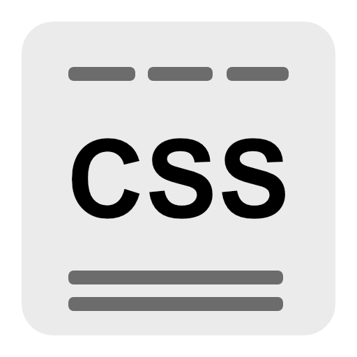
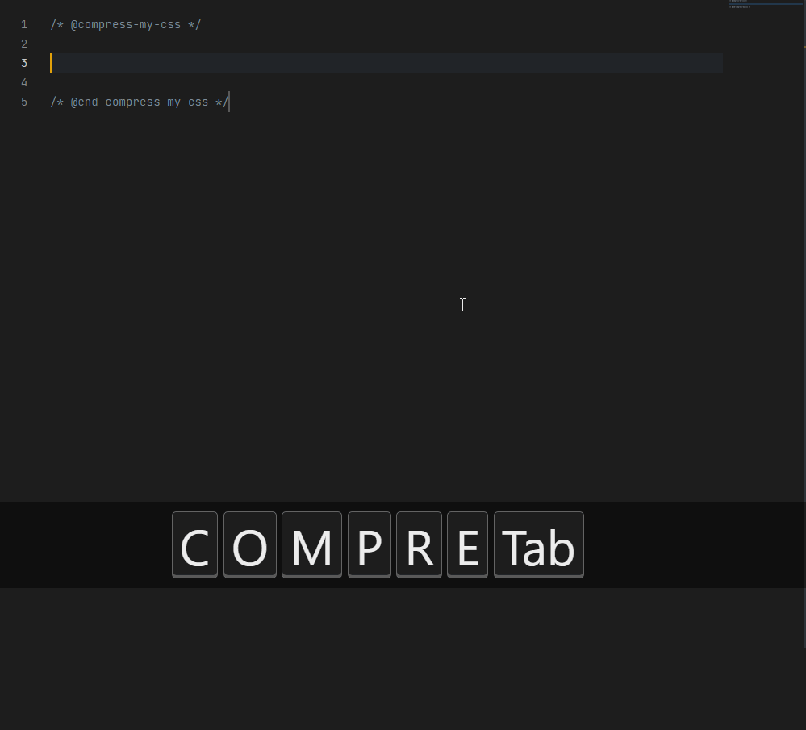

<h1 align="center">
  <br>
    
  <br><br>
  Compress My Css
  <br><br>
</h1>
<p align="center">
  A unique CSS stylesheet formatter with single-line (stacked) rules formatting support.
  <br>
  <a href="https://marketplace.visualstudio.com/items?itemName=guasam.compress-my-css">Compress My Css - Visual Studio Marketplace</a>
</p>
<br>
<p align="center">
    <a href="https://marketplace.visualstudio.com/items?itemName=guasam.compress-my-css"></a>&nbsp;
    <a href="https://marketplace.visualstudio.com/items?itemName=guasam.compress-my-css"></a>&nbsp;
    <a href="https://marketplace.visualstudio.com/items?itemName=guasam.compress-my-css"></a>&nbsp;
    <a href="https://marketplace.visualstudio.com/items?itemName=guasam.compress-my-css"></a>
</p>

<br>

**Compress My Css Demo :**



<br><br>

## 👩‍💻 How to use

You can compress stylesheet rules code by surrounding it with a special comment tag region.

**Start Tag**

```css
/* @compress-my-css */
```

**End Tag**

```css
/* @end-compress-my-css */
```

<br>

## 👩‍💻 Apply region specific compression mode

You can asssign a compression mode for a region by changing **starting** comment tag to :

<br>

**Stacked Mode :**

```css
/* @compress-my-css : stacked */
```

<br>

**Minified Mode :**

```css
/* @compress-my-css : minified */
```

<br>

**Ignore Mode :**

```css
/* @compress-my-css : ignore */
```

<br>

## 🔎 Compression modes

**Stacked Mode**

Stack mode formats stylesheet code to have single-line per stylesheet selector rule.

```css
body { color:red; font-weight:bold; background:red; }
#app { font-size:1rem; margin:10px 20px 30px 40px; }
#container { display:flex; flex-direction:column; }
...
```

<br>

**Minified Mode**

Minified mode formats stylesheet code to have only one line for all stylesheet rules.

```css
body {color:red;}#app {font-size:1rem;}#container {display:flex; flex-direction:column;}...
```

<br>

**Ignore Mode**

Ignore mode is useful if we want to mark a region without applying compression/format.

(**NOTE** : If no compression mode provided in comment tag, it will use default mode based on extension settings)
<br>

## ⚙️ Extension Settings

Following settings are available with this extension :

- Enable/Disable compression on file save.
- Enable/Disable information dialog after compression.
- Select default compression mode.
- Space after stylesheet rule selector.
- Space inside stylesheet rule parantheses.
- Space between stylesheet rule properties.
- Remove comments from stylesheet.

<br>

## ♾️ Developer Comments

In the begining, this extension was created for personal use only as a web application, but switching back to browser and vscode was a bit nightmare. So the idea was to create a dedicated open-source extension for Visual Studio Code and distribute it to everyone who is interested in such kind of tool for stylesheet formatting in single-line (stacked) format.

As the backend of this extension is using only "Regex Expressions" for matching, replacing the text from editor. There might be some use-cases where the extension will provide unwanted results.

Feel free to contribute into repository for improving this extension :<br>https://github.com/guasam/compress-my-css-vscode
